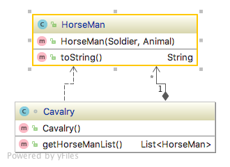

# Adapter pattern
    * Structural

## Intent
Convert the interface of a class into another interface clients expect. Adapter lets classes work together that couldn’t 
otherwise because of incompatible interfaces.

## Applicability
Use the Adapter pattern when

• you want to use an existing class, and its interface does not match the one you need. 

• you want to create a reusable class that cooperates with unrelated or unforeseen classes, that is, classes that don’t 
necessarily have compatible interfaces. 

• (object adapter only) you need to use several existing subclasses, but it’s impractical to adapt their interface by 
subclassing every one. An object adapter can adapt the interface of its parent class.

## Real world examples

## Reference
[Design Patterns: Elements of Reusable Object-Oriented Software by Erich Gamma, Richard Helm, Ralph Johnson and John Vlissides.](https://www.amazon.com/Design-Patterns-Elements-Reusable-Object-Oriented/dp/0201633612/)