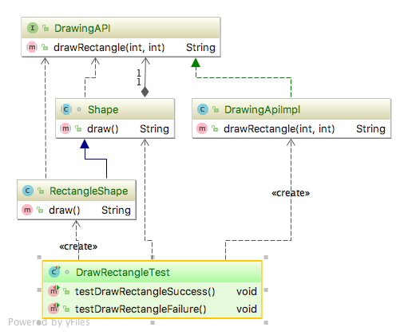

# Bridge pattern
    * Structural

## Intent
Intent Decouple an abstraction from its implementation so that the two can vary independently.

## Applicability
Use the Bridge pattern when

• You want to avoid a permanent binding between an abstraction and its implementation. This might be the case, for 
example, when the implementation must be selected or switched at run-time.

## Real world examples

* 

## Reference
[Design Patterns: Elements of Reusable Object-Oriented Software by Erich Gamma, Richard Helm, Ralph Johnson and John Vlissides.](https://www.amazon.com/Design-Patterns-Elements-Reusable-Object-Oriented/dp/0201633612/)