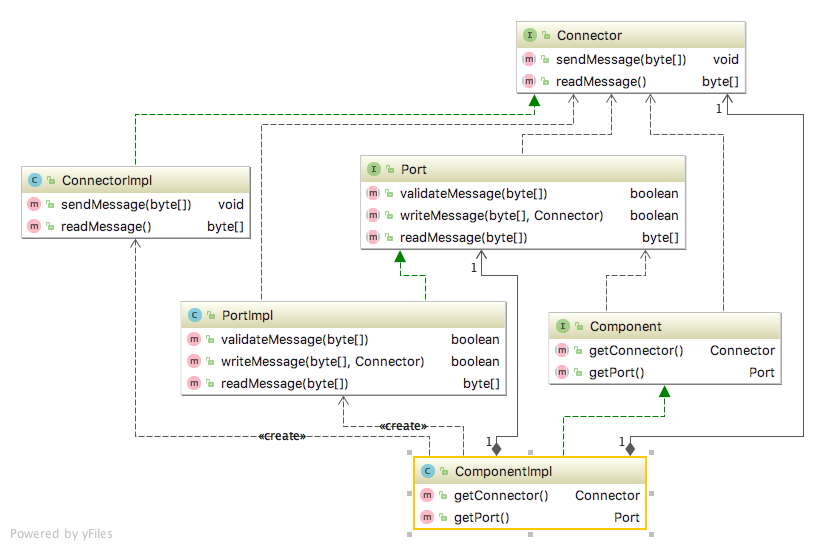

# Component structure

## Intent
To use for architecture evident coding style. To guide the developer to the concept of defining an interface as an 
executing component, and to make clear of the isolation of the other classes that implements the component only 
accessible by the component. A component interface does not need to have  abstract methods, the component interface could 
be empty, just for guidance of defining a component for developers if the design model is vague.

## Applicability
To guide the developer to follow the architecture by defining the components as an interface (with accessible methods),
 and to prevent them to break the architecture by trying to modify the visibility level of the classes that implements 
 the component.

## Real world examples
All EJB containers in Java EE has runtime components.

* [javax.persistence.EntityManager](https://docs.oracle.com/javaee/7/api/javax/persistence/EntityManager.html)

## Reference
[Just Enough Software Architecture by George Fairbanks](https://www.amazon.com/Just-Enough-Software-Architecture-Risk-Driven/dp/0984618104/)