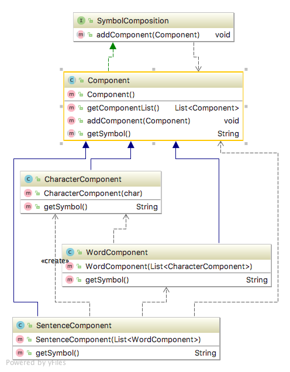

# Composite pattern
    * Structure

## Intent
Compose objects into tree structures to represent part-whole hierarchies. Composite lets clients treat individual 
objects and compositions of objects uniformly.

## Applicability

Use the Composite pattern when 

• you want to represent part-whole hierarchies of objects.

• you want clients to be able to ignore the difference between compositions of objects and individual objects. Clients 
will treat all objects in the composite structure uniformly.

## Real world examples

## Reference
[Design Patterns: Elements of Reusable Object-Oriented Software by Erich Gamma, Richard Helm, Ralph Johnson and John Vlissides.](https://www.amazon.com/Design-Patterns-Elements-Reusable-Object-Oriented/dp/0201633612/)