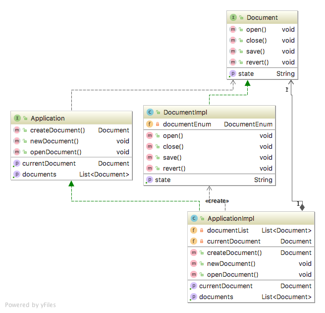

# Factory Method
    * Creational

## Intent
Define an interface for creating an object, but let subclasses decide which class to instantiate. Factory Method lets
a class defer instantiation to subclasses.
         

## Applicability
Use the Factory Method pattern when 

• a class can’t anticipate the class of objects it must create. 
• a class wants its subclasses to specify the objects it creates.
• classes delegate responsibility to one of several helper subclasses, and you want to localize the knowledge of which 
helper subclass is the delegate.

## Real world examples

* [java.util.Calendar](http://docs.oracle.com/javase/8/docs/api/java/util/Calendar.html)

## Reference
[Design Patterns: Elements of Reusable Object-Oriented Software by Erich Gamma, Richard Helm, Ralph Johnson and John Vlissides.](https://www.amazon.com/Design-Patterns-Elements-Reusable-Object-Oriented/dp/0201633612/)