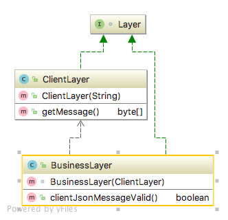

# Layered structure

## Intent
All complex systems experience the need to develop and evolve portions of the system independently. For this reason 
the developers of the system need a clear and well-documented separation of concerns, so that modules of the  system 
may be independently developed and maintained.

The software needs to be segmented in such a way that the modules can be developed and evolved separately with little
interaction among the parts, supporting portability, modifiability, and reuse.

To achieve this separation of concerns, the layered pattern divides the software into units called layers. Each layer is
a grouping of modules that offers a cohesive set of services. There are constraints on the allowed-to-use relationship 
among the layers: the relations must be unidirectional. Layers completely partition a set of software, and each 
partition is exposed through a public interface. The layers are created to interact according to a strict ordering 
relation.

## Reference
[Software Architecture in Practice by Len Bass, Paul Clements, Rick Kazman](https://www.amazon.com/Software-Architecture-Practice-3rd-Engineering/dp/0321815734)