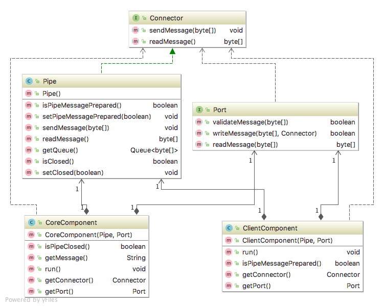

# Pipes And Filters structure

## Intent
Pipes and filters structure style is used to setup one direction message connector between filters (components/modules).
The filter deals with parsing the expected data and sends it to the next filter that exists through a one directional 
pipe. 

## Applicability
To have high modifiability for setting up filters and use their expected interfaces to manipulate data,

## Reference
[Just Enough Software Architecture by George Fairbanks](https://www.amazon.com/Just-Enough-Software-Architecture-Risk-Driven/dp/0984618104/)