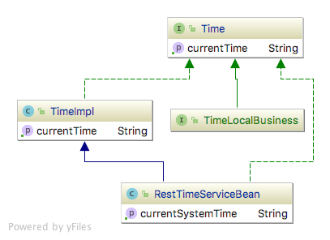

# EJB Service (proxy) pattern

## Intent
Obtain a proxy reference to an EJB service. Demonstrating how to use and test EJB services.

## Applicability
Services can be accessed by proxy to let the developers focus on main development and let the services be allocated 
at runtime when the application is started.

## Reference
[Enterprise JavaBeans 3.1: Developing Enterprise Java Components by Andrew Lee Rubinger, Bill Burke](https://www.amazon.com/Enterprise-JavaBeans-3-1-Developing-Components/dp/0596158025)